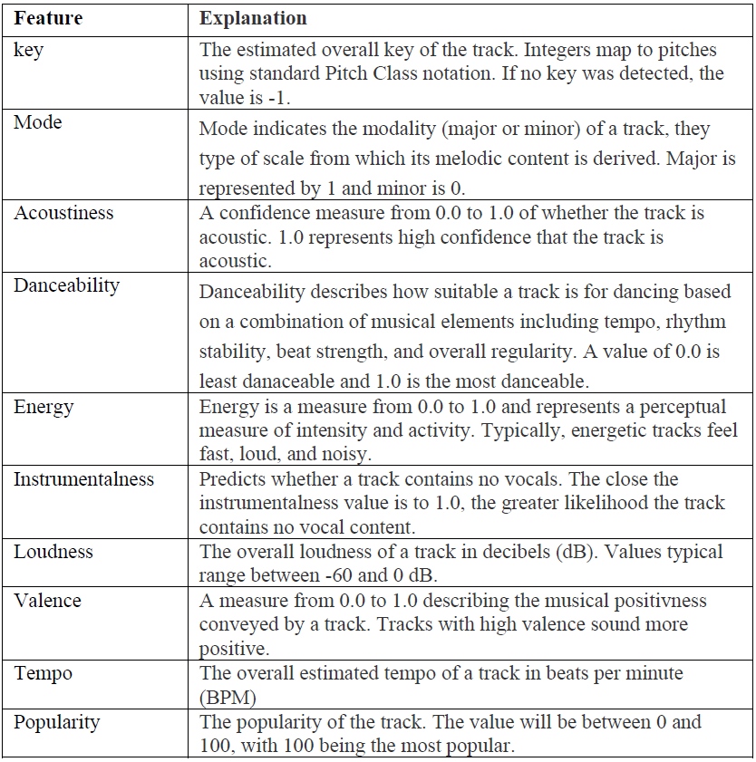
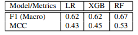
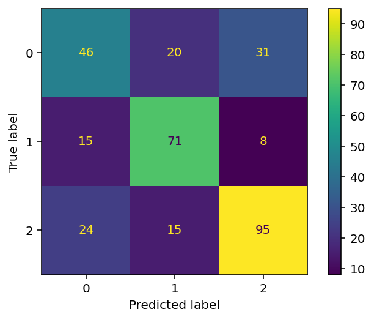
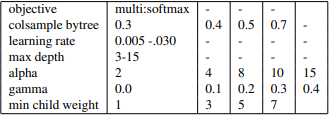
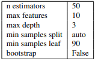
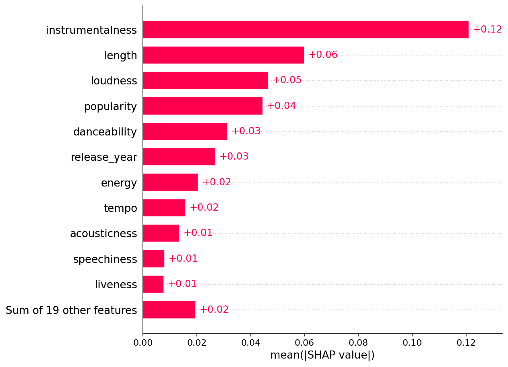

```{r setup, include=FALSE}
knitr::opts_chunk$set(echo = FALSE)

# Load dependencies 
library(reticulate) # For rendering Python code 
library(distill)
```

## Abstract 

The exercise of Classification in Music has been a natural playground for simple and complex Machine Learning
(ML) tasks alike, largely due to the complexity of ’sound’
and the volume of data available. In order to elaborate on the question whether song-features can be utilized to predict a user's music taste, the project takes a sample of the musical ’libraries’ of the three group members and applies various models under
the ML umbrella in attempts to classify ’who’ the song ’belongs’ to. Results between Logistic, XGBoost, and RandomForest models are assessed, with the RandomForest _(F1 = .67)_ proving
strongest.


## Introduction / Background

Few things are as personal as taste in music; no two
people are identical, right? Listeners want to listen to music they
enjoy and discover more music to listen to – it’s a simple
concept. Companies and independent agents alike have
understood this phenomenon, and pioneered and refined
the idea of taste-based recommendation for decades,
exactly because it lies at the center of musical enjoyment.
The better you can give people what they like, the more
demanded your service becomes. Classification becomes a
powerful tool.

In general we can think about music personalization as a two-way street. 
The insights gathered by Spotify allows them to see that there might be a young Brazil artist who has music that would be a hit in Scandinavia. And Spotify has the power to bring that music to those listeners in Scandinavia through their personalization channels. This then introduces the artist to a more global audience that might not have been able to discover them on their own. (cite) In order to understand music taste prediction better let's take a closer look into two mayor approaches of builing a classification model for our purposes.

**Collaborative Filtering Model**: The basic concept is rather than recommend songs (but also e.g., movies and ither items) based on similarities between songs, collaborative filtering focuses on similarities between users that listen to certain songs. For example: If two user A and B have their top-four favorite artists in common but not the fifth, then user A gets recommended the top-fifth artist of user B and vice versa. This kind of filtering is called collaborative filtering [@slaney2011web]. 


**Audio File Modeling**: This type of modeling (also called content-based modeling) is on what we focus on here. It is the same what Facebook does to images, Spotify does to Audio. Spotify analyzes each individual audio file’s characteristics, including tempo, loudness, key and time signature. Based on this, each audio file is indexed to different characteristics. Then this is used as values to suggest songs based on what kind of music the user generally listens to. This approach not only improves the quality of recommendations for existing songs, but also enables the discovery of new songs that are less popular and is therefore very important approach to ensure fairness at the platform and at the music market in general.

In our work we focused on the second type of modeling because our general interest was to think of an way to democratize platforms such as Spotify and transform them towards an more fair marketplace for listeners AND artists.

<!-- slanley2011: For example, if you want to judge the similarity of two different pieces of music, should you look at the musical notes, or should you look at what people say about the music? Similarly, how should you find the best movie to recommend to a friend? Shouldn’t the genre of the movie matter? Or when tagging a photo, is it better to look at the pixels, or where the picture lives on the Internet? Iwant to think that content matters, but in all three cases, metadata about the content proves to be more useful. ->** It seems that collaborative filtering (which was aforementioned) tends to outperform content-based recommendations** --->

## Related Work 

- [@silla2008machine] presents an unconventional approach to
the standard ’feature-based’ automatic music classification exercise. The paper makes use of Space Decomposition and Time Decomposition, which consist
respectively of 1) ’decomposing’ variables (features)
into individual binary classifiers and merging these results to form an aggregate, and 2) ’decomposing’ observations (audio files) into tripartite segments, where
songs are cut and slices are obtained from different
parts of the original music signal. The experiment uses
decision trees as well as a sample pool of 3,160 songs,
making it similar to our own study in terms of scale
and tools as well as in its manipulation and encoding
of variables. Its conclusions show that the explanatory
capacity of each feature varies ”according to [its] origin in the music signal”.
- [@DBLP:journals/corr/abs-1804-01149], instead, *reduces* the scope of classification, but increases the granularity of modeling. The exercise looks at classification specifically for ’genre’ of music, and compares a deep learning
model that uses solely audio spectograms to a second model that relies on manually-labeled features of
songs. Findings show that a third model (combining
both models) is the most effective. As in our own
study, making use of both labels and ’raw’ properties
proves to be effective.
- [@6703770] departs from the classical problem of ML and musical classification (namely: its inherent difficulty) and presents the greater task of classification through the lens of computational load and
the impact that an automated classification system has
when used at scale and in the commercial realm. The
paper uses a novel learning tool, ”Extreme Learning
Machines” (ELM), to focus on this efficiency and finds
that, while ’good’ classification remains complex and
elusive, models such as ELM decrease computational
costs without loss of effectiveness. The paper’s ideas
on scaling algorithms and its proximity to commercial
implications are highly relevant to our study.
<!--**Footnotes and Sidenotes**

You can use footnotes ^[This is a footnote. You can view this by hovering over the footnote in text.] or sidenotes to elaborate on a concept throughout the paper. 

<aside>
This is a side note. 
</aside> -->
## Proposed Method 

For building our baseline model we choose a multinomial logistic regression model. We do so because we
will use multiple predictors, namely *’length’; ’popularity’; ’acousticness’, ’danceability’, ’energy’, ’instrumentalness’, ’liveness’, ’loudness’, ’speechiness’, ’valence’* and
*’tempo’* in order to classify an output between three classes (you can find the exhaustive selection of features in Figure 1).
These classes translate to our three sampled users. Here, the
aforementioned features come from Spotify’s API (further
explored in the ’Experiments’ section). The multinomial
logistic regression is an extension of the two-class logistic
regression approach which can be applied to all settings of
K larger than two classes. Beyond this, a logistic regression
has the advantage of being fast in training and prediction
time. Moreover, the output can be interpreted as probability
scores. However, since we have a multi-class problem we
need to pay attention to how coefficients are interpreted.
For the interpretation of the coefficients, it is crucial to
take into account their being tied to the choice of baseline,
which is one of the three *users* in our model.
More precisely, our baseline consists of 1300 samples. The data was separated into 75% training-data (975
samples) and 25% (325 samples) test-data. For our first
model we created a pipe consisting of a standardscaler
and the multi-class logistic regression model. In addition,
we run cross-validation with ten folds. We report our experiments and exercises metrics [@barat_2022] in the following section.
In addition we will focus on tree-based methods due
to the available evidence that tree-based models such as
XGBoost outperform other models on tabular data [@borisov2021deep].

```{r fig1, eval = TRUE, echo = FALSE, out.width = '100%', fig.cap = "The table shows all relevant features that are provided by Spotify’s API (besides release year). The left column shows the specific feature’s name and the right hand side offers a brief description of it."}

```

## Experiments 

**Data**: This project utilized song data taken from directly
from Spotify playlists. Every year, Spotify releases a *top-100 Songs* playlist for each of their customers that provides their most listened songs of that year. Playlists
ranging from 2016 to 2021 were used for the three individuals in the group, and the playlists were chosen because they
are the most efficient way of illustrating the music tastes of
each individual. In order to pull this song data into Python,
Spotipy was used. Spotipy is a lightweight Python library
for the Spotify Web API. With Spotipy, you are able to gain
full access to all of the music data provided by the Spotify
platform.

 
**Software**: For this project, we utilized Python
and PyCharm as our IDE. ^[More information about
Python can be found at: Python Software Foundation.
Python Language Reference, version 3.9. Available
at http://www.python.org JetBrains, 2017. PyCharm.
Available at: https://www.jetbrains.com/pycharm/
ethod]

**Evaluation method**: Our study employed a standard set
of evaluation methods. The methods used are based off confusion matrix manipulations:

- 1. **Base Metrics** - Used simply during experiments as
quick metrics to evaluate whether models are running correctly, whether results match our expectations, and to form more complex methods. These include *Precision*, *Recall*, and *Accuracy*.^[Note: Accuracy is a poor metric when used individually, and can be
severely misleading when there is a large class imbalance present in the
data. In our case, similar volume across classes (400, 400, 500) means that
Accuracy in conjunction with Precision and Recall was satisfactory for
’back of the napkin’ calculations. Accuracy was not used for final result
evaluation] In general, we
judged positively models with high precision and recall scores, but kept a critical eye to the trade-off between precision and recall (since improving one of the
two often results in worsening the other).

- 2. **F1** - Used as a ’better’ alternative to the base methods, but still not satisfactory as a standalone metric. While the F1 harmonic mean is convenient for
comparison, the group was wary of the relative importance we deemed appropriate to assign to precision and recall. In other words, F1 was still potentially misleading because it does not take domain
knowledge into consideration, as well as the fact
that this effect of *unequal-severity-from-different-misclassifications* is compounded when the task is a multiclass problem (as is the case here).
Another important point to highlight here is that of the
type of F1 used in our evaluation. Between Macro, Micro (Accuracy), and Weighted F1 scores, we decided to
focus on the Macro scores. Similar to our reasoning in
previous decision, the class imbalance in our data was
not so severe that the use of Macro^[Simple Arithmetic Mean
] was not impractical when compared to Weighted^[Weighted Average, where each weight is the proportion of samples
that its parent classification constitutes of the total observations.] F1.

- 3. **Matthew Correlation Coefficient** - Used as the final standalone metric for our models. Though it is
typically used in binary classification scenarios, the
Matthew Correlation Coefficient (MCC) shines as well
in multi-class scenarios. It is more reliabile than the
base metrics and F1, returning a high score only when
all confusion matrix categories 5
are in a good place,
and, though less necessary for our case, it is also adept
at taking into account imbalances in datasets.
Figure 2 illustrates F1 (Macro) and MCC scores between the three primary models.

```{r fig2, eval = TRUE, echo = FALSE, out.width = '100%', fig.cap = "Primary Evaluation Metrics."}

```

In addition, Figure 3 illustrates the Confusion Matrix associated with
the Random Forest model.
Interestingly, the number of correct predictions for *y* = 0
(Fabian) is strikingly low. We anticipated that this was due
to a difference in the strength of the Spotify song features
associated with his playlist. The relationships each of these
features has with our models will investigated further in the
Analysis section.

```{r fig3, eval = TRUE, echo = FALSE, out.width = '100%', fig.cap = "RandomForest Confusion Matrix."}

```


**Experimental details**: We decided to proceed with three
different classification models to work with our newly created Spotify data that contained information on the three
individuals. These were: Logistic Regression, XGBoost,
and Random Forest. Each will be discussed in details in the
following paragraphs.

```{r fig4, eval = TRUE, echo = FALSE, out.width = '100%', fig.cap = "Random Forest parameters to test."}

```

We began our work with a Logistic Regression model.
We started by setting all of the previously discussed Spotify
song features as our X-value (our predictors) and for our y-value, we used our newly created ”Users Name” variable.
The goal of this model was for it to be able to successfully
determine which songs in the test data belonged to which
individual. After setting our X and Y values, we split our
data into X-train, X-test, y-train, and y-test with sklearn’s
train-test-split function and imported our Logistic Regression model, also from sklearn. The next step was to set up a
pipeline that first utilized StandardScaler as our scaler and
Logistic Regression as our model. We made sure to set the
multi-class for the model as ”multinomial” since there are
three different classification options. After this process was
complete, we fit our training data to the model and used it
to predict our y-value. To help evaluate the effectiveness
of our model, we utilized cross-validation with the number
of splits being 10, a random state of 123, and shuffle being
True. The results of this calculation will be illustrated in the
next section of this paper, Results.
Though our Logistic Regression was a good method of beginning our work with the Spotify data, we wanted to
incorporate additional models in order to determine which
was the most effective as classifying the Spotify songs by
individual.

```{r fig5, eval = TRUE, echo = FALSE, out.width = '100%', fig.cap = "Best XGBOOST paramters"}
knitr::include_graphics("figures/xg_param.png")
```
The next model created was XGBoost. XGBoost is a popular machine learning algorithm used to deal
with structured data for regression and classification. The
first step in this process was altering our initial y-value to
make it compatible with XGB. This step involved replacing
the written name of each individual and replacing it with
a stand-in numeric value. Therefore, Luke became 2, JP
became 1, and Fabian became 0. Once this brief step was
complete, we created a new data structure, Dmatrix, which
is supported by XGBoost. We were then ready to set up our
baseline model for XGB with the initial parameters shown
in Figure 1. Once these initial parameters were set, we were ready to
fit the model to our previously specified training data. Afterwards, we were able to used this fitted model to predict
our y-value. To help evaluate this baseline model, we once
again utilized cross-validation. The results of this calculation will be illustrated in the Results section of the paper.
With our baseline model completed, we proceeded to the
hyperparameter tuning portion of the process. In order to
determine the best parameters for our model, we created
a set of parameters for us to test with RandomSearchCV.
We looked at six XGBoost parameters: colsample-bytree,
learning rate, max depth, alpha, gamma, and min-childweight. The values for these parameters are provided in
Figure 4.
Once these parameters to test were set, we set our RandomSearchCV function to fit on our X and y values. After
this process was complete, we were able to determine which
combination of the aforementioned parameters gave us the
best outcome in our model. The resulting best parameters
are illustrated in Figure 5.
We then created a final XGBoost model incorporating
these parameters. The final results of this model will be
illustrated in depth in the Results section of this paper, but
we ultimately did observe an increase in performance of the
model with these new hyper-tuned parameters.

The final model that we utilized for this project was a
Random Forest Classifier model. To begin, we set up a
baseline model with 100 n-estimators. We proceeded to fit
this baseline model to our training data and used it to predict our y-value. Once again, we utilized cross-validation to
measure the effectiveness of this baseline model - the results
of which will be illustrated shortly in the Results section.
Once our Random Forest baseline model was complete, we
proceeded with the hyperparameter tuning process. For our
Random Forest model, we focused on the following parameters: n estimators, max features, max depth, min samples
split, min samples leaf, and bootstrap. In a near identical process to our hyperparameter tuning of the XGBoost
model, we provided a number of potential parameter values.

```{r fig6, eval = TRUE, echo = FALSE, out.width = '100%', fig.cap = "Best Random Forest Parameters"}

```

Once the hyperparameter tuning process was completed, we were left with the best parameters to utilize for our Random Forest Model. These best parameters can be found in Figure 6. We went on to incorporate these hyperparameter
suggestions in our final Random Forest model. Ultimately,
our Random Forest model ended up being the most effective
of the three models that we developed.


**Results**: As mentioned during the Experiment Details
portion of the paper,this section will outline the results of
our models prior to a more in depth analysis of our findings. In Figure 2, we revisit the previously provided F1 and
MCC scores for each model utilized for this project. Interestingly, the Random Forest model had the highest F1 score
at 0.67 compared to values of 0.62 for the Logistic Regression model and 0.62 for the XGBoost model.

## Analysis 

Since we already discussed and compared our models to
the baseline model we want to dig a bit deeper in this section. Since we do not know what features have driven our models (or rather predictions) we include the SHAP (Shapley) value method. SHAP allows us to quantify the contribution of the features in our model. ”An intuitive way to
understand the Shapley value is the following illustration:
The feature values enter a room in random order. All feature
values in the room participate in the game (contribute to the
prediction). The Shapley value of a feature value is the average change in the prediction that the coalition already in the
room receives when the feature value joins them” [@molnar2020interpretable]. In
other words the feature’s Shapley value can be interpreted
as the contribution to the difference between the mean prediction and the actual prediction [@molnar2020interpretable].
In Figure 7 the interested reader can find a table that
shows the importance of each of the model’s feature. The
feature on top is most important feature. According to our
results, instrumentalness, length, and loudness are the features that contribute the most to the change in probability.
For instance, instrumentalness is the most important feature
in our model with a score of 0.12, changing the predicted
user probability on average by 12 percentage points. However, it is important to mention that the SHAP feature importance relies on the decrease in model performance (without the feature) but contains no information beyond that.

```{r fig7, eval = TRUE, echo = FALSE, out.width = '100%', fig.cap = "SHAP Feature Importance measures as the means absolute Shapley values. The instrumentalness is the most important feature, changing the predicted user value probability on average by 12 points."}

```


## Conclusion(s)

One of the core limitations of these types of classification models is the assumption that one’s music tastes
can be simplified to a mere numeric score– that can be
predicted. There are a number of non-quantifiable factors
that contribute to one’s music taste, such as the listening
preferences of peers, what you grew up listening to, or
music that is representative of your own culture. While
analyzing the features provided by Spotify for each of the
songs hosted on their platform can offer very interesting
insights into the musical preferences of listeners, this
prediction misses some key external factors in the creation
of one’s music taste.

Nowadays recommender systems (such as the one of
Spotify) rely on usage patterns. These patters rely on combinations of items (music tracks) that users have consumed
or rated. This provides data about the users’ preferences
and data about how songs relate to each other [@van2013deep]. For
instance, one core feature of Spotify’s recommender
system is to compare Users and their favorite artists. A
simple example: If two user A and B have their top-four
favorite artists in common but not the fifth, then user A gets
recommended the top-fifth artist of user B and vice versa.
This kind of filtering is called collaborative filtering [@slaney2011web].


Although research suggests that collaborative filtering
outperforms content-based recommendations, our results
show that it is possible to perform useful predictions.
However, since the number of the users (and the songs)
were rather limited, we can not gather strong claims on that
topic. Future work should focus in maximizing the size of
the dataset and focus on the combination of collaborative
and content-based recommendations. Also, it might be
useful to take an interdisciplinary angle and consult, for
example, the field of *Sociology of Music*.


## Acknowledgments 

One of our initial inspirations for this particular project
came from Adam Reevesman’s article on Towards Data Science^[https://towardsdatascience.com/spotify-wrapped-data-visualization-and-machine-learning-on-your-top-songs-1d3f837a9b27]. It provided a framework for how Spotipy can be used
to gather information about an individual’s song preferences
and encouraged us to pursue this idea further. Additionally,
the code he utilized to pull and clean the data from Spotify was essential in ensuring that we had a well structured data
file to work with as we built out our three models.
